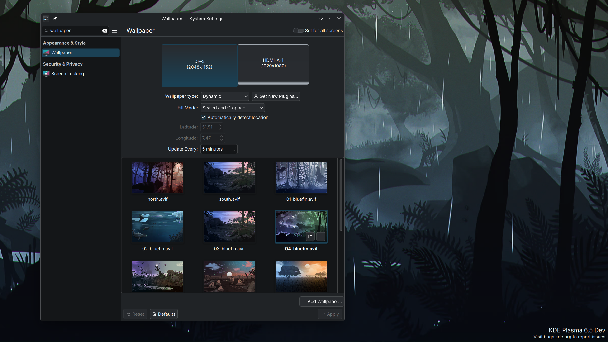

## About
These are all the cool Bluefin Wallpapers converted in a way so [this KDE Wallpaper plugin](https://github.com/zzag/plasma5-wallpapers-dynamic) can do something useful with it.

You will get a wallpaper that changes the lighting dynamically depending on your time.

These files are worthless for you if you don't have this plugin.

## How to use

- Install https://github.com/zzag/plasma5-wallpapers-dynamic

- Download all the wallpapers from the [github releases page](https://github.com/renner0e/plasma-bluefin-wallpaper/releases) and put them somewhere in your home directory like `~/.local/share/backgrounds/bluefin-plasma-dynamic/`

- Open Settings > Appearance & Style > Wallpaper and set "Wallpaper type" to "Dynamic"

> [!WARNING]
> You have to set your wallpaper type as dynamic, the default type won't work and the actual file will display, resulting in a loop between day and night!

## Attributions
Dinosaur images are comissioned by the uBlue maintainers and made available under the Apache License 2.0 in the [corresponding repo](https://github.com/ublue-os/packages)
